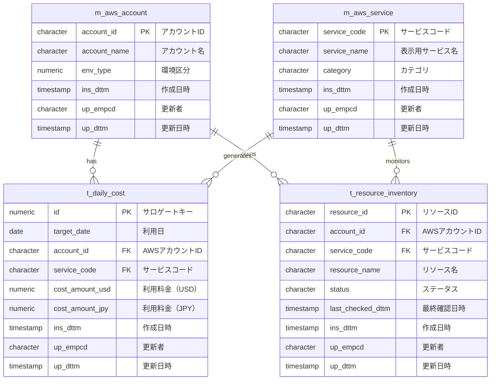

# aws-cost-monitoring-dashboard
AWS Cost and Resource Monitoring Dashboard (Spring Boot 3 / Python / PostgreSQL)
## データベース設計（ER図）

本プロジェクトのデータベースはPostgreSQLを使用し、以下の設計としています。

```mermaid
erDiagram
    m_aws_account ||--o{ t_daily_cost : "has"
    m_aws_account ||--o{ t_resource_inventory : "owns"
    m_aws_service ||--o{ t_daily_cost : "generates"
    m_aws_service ||--o{ t_resource_inventory : "monitors"

    m_aws_account {
        character account_id PK "アカウントID"
        character account_name "アカウント名"
        numeric env_type "環境区分"
        timestamp ins_dttm "作成日時"
        character up_empcd "更新者"
        timestamp up_dttm "更新日時"
    }

    m_aws_service {
        character service_code PK "サービスコード"
        character service_name "表示用サービス名"
        character category "カテゴリ"
        timestamp ins_dttm "作成日時"
        character up_empcd "更新者"
        timestamp up_dttm "更新日時"
    }

    t_daily_cost {
        numeric id PK "サロゲートキー"
        date target_date "利用日"
        character account_id FK "AWSアカウントID"
        character service_code FK "サービスコード"
        numeric cost_amount_usd "利用料金（USD）"
        numeric cost_amount_jpy "利用料金（JPY）"
        timestamp ins_dttm "作成日時"
        character up_empcd "更新者"
        timestamp up_dttm "更新日時"
    }

    t_resource_inventory {
        character resource_id PK "リソースID"
        character account_id FK "AWSアカウントID"
        character service_code FK "サービスコード"
        character resource_name "リソース名"
        character status "ステータス"
        timestamp last_checked_dttm "最終確認日時"
        timestamp ins_dttm "作成日時"
        character up_empcd "更新者"
        timestamp up_dttm "更新日時"
    }
```
